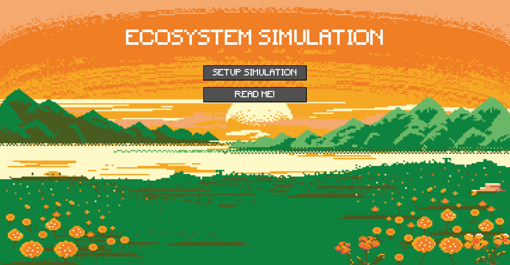
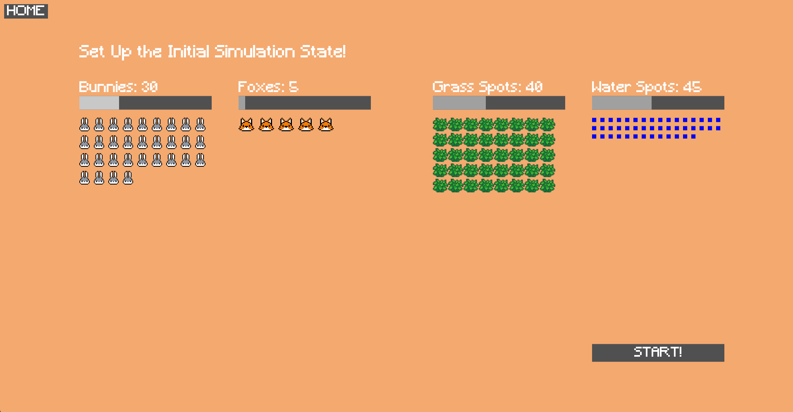
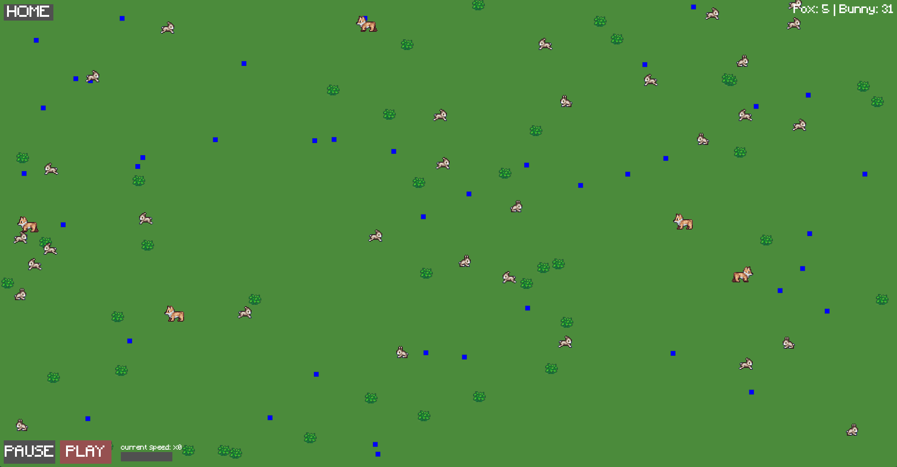
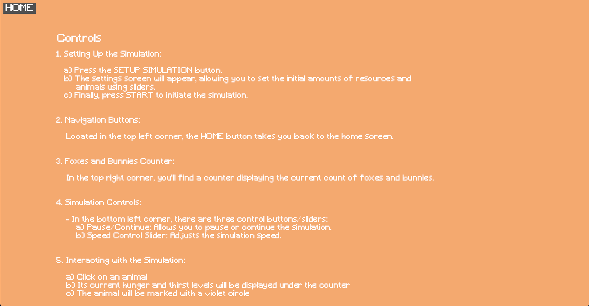
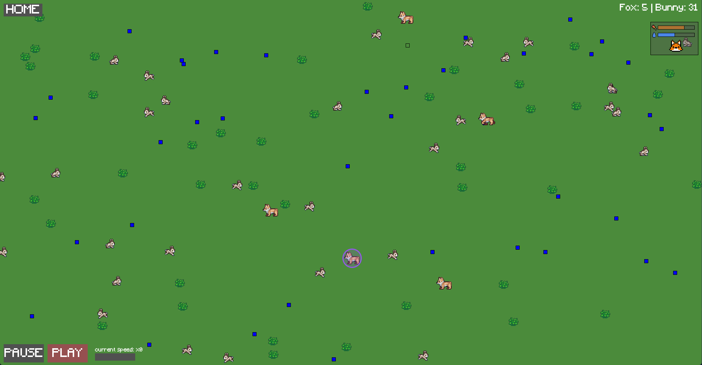

# Ecosystem Simulator
***

Ecosystem Simulator is a program designed to simulate the growth and decline of the population within an ecosystem.
It showcases interactions between bunnies, foxes and the resources given by the environment.
***
### Functionalities
#### Bunnies can...
- eat and drink from the given resources.
- mate with each other  under the right circumstances to generate new bunnies.
- run away from carnivores like foxes.
#### Foxes can...
- drink from resources.
- hunt bunnies for food.
- mate with each other under the right circumstances to generate new foxes.
#### Resources can...
- give their contents to an animal.
- regenerate their contents.
***
## Steps To Start The Program
0. Ensure you have JDK 21 installed
1. Open the project in your IDE
2. Open the `Main.java` file
3. Run `Main.main()`
4. Now the title screen should welcome you

5. Press `SETUP SIMULATION`
6. Now the settings screen should appear, in which you can change initial values of the simulation

7. Finally, press `START` to start the simulation

8. Have Fun!
***
## Controls
- To read the instructions from within the program just press `READ ME!` in the title screen

- Press `HOME` in the top left corner to return to the title screen
- Press `PAUSE / PLAY` in the bottom left corner to pause or play the simulation
- Slide the `current speed` slider in the bottom left corner to change the speed of the simulation

- Click any animal and the current thirst and hunger values of that animal should appear, it should also be marked

***
## Model Test In JShell
Note: I've moved the code from the model into a `.jsh`-file named `model.jsh` to make it easier to start the JShell process.

1. Open your terminal
2. Type the command `jshell` to open the JShell
3. Type the command to open `model.jsh`
    - For windows `/open path\to\EcoSim\model.jsh`
    - For linux & mac `/open path/to/EcoSim/model.jsh`
4. Create a new model object for a 1000x1000 ecosystem
    - `EcoModel model = new EcoModel(1000,1000)`
5. Initialize the simulation with a specified number of bunnies, foxes, water sources and grass sources
    - `model.startNewSim(25, 5, 100, 100)`
6. Start a new thread for the simulation
    - `model.startEcoSimulationThread()`
7. Adjust the simulation speed
    - `model.setSimulationSpeed(1)`
8. Get the current count of herbivores (true) and carnivores (false)
    - `model.getAnimalCountOf(true)`
    - `model.getAnimalCountOf(false)`
9. Let the simulation run and get the information about the count of animals after a short while
***
## Sources
### Libraries
- [Processing](https://processing.org/)
- [controlP5](https://www.sojamo.de/libraries/controlP5/)
- [JUnit 5](https://junit.org/junit5/)
### Information
- [Processing tutorial](https://www.youtube.com/watch?v=3D2lJmdS3wI&t=153s) for animation.
### Images
- [Spritesheets for Animals](https://forums.terraria.org/index.php?threads/need-sprite-sheets-for-bunny-cat-and-dog.118698/)
- [Background Image](https://de.freepik.com/fotos-vektoren-kostenlos/pixel-feld)
- [Bunny Face](https://www.vectorstock.com/royalty-free-vector/8-bit-pixel-rabbit-head-vector-37878211) for settings menu.
- [Fox Face](https://www.vectorstock.com/royalty-free-vector/fox-head-pixel-image-for-game-assets-vector-38187229) for settings menu.
